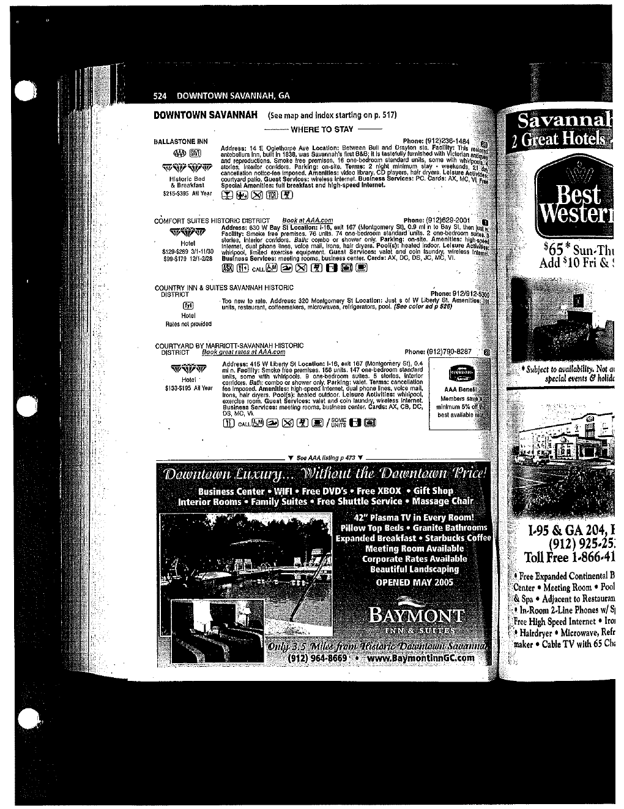
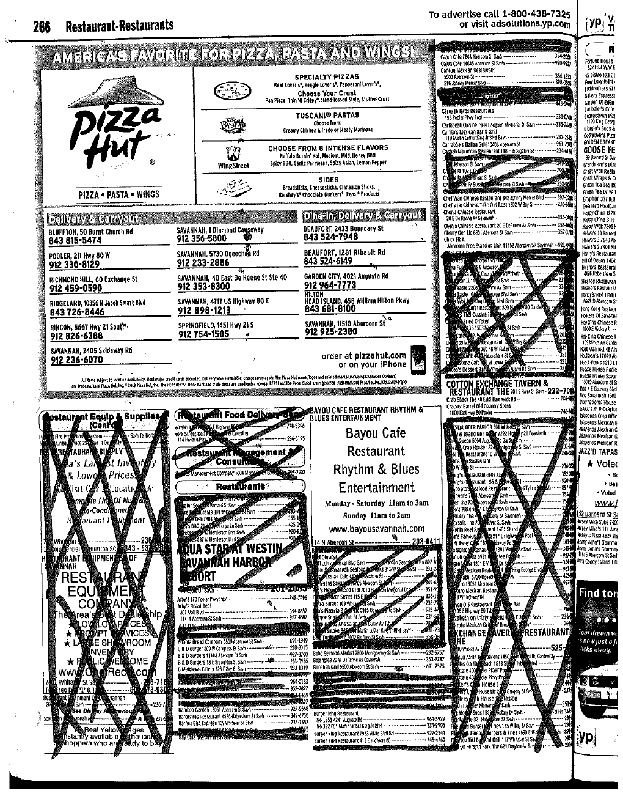

# From scanned directory pages to relational data

This project began with selected hotel and restaurant pages rather than a ready-made spreadsheet. The pages mix listings, advertisements, icons, prices, prose, phone numbers, web addresses, and handwritten review marks. Important fields also move between columns or disappear entirely from one listing to the next.

Only the hotel and restaurant sections used for Autenia Murray's assigned portion of the team project are included here. The original reference contained additional categories that were outside this extraction scope.

## Raw source examples

| Hotel page | Restaurant page |
|---|---|
|  |  |

The complete selected excerpts are available as [`savannah_hotel_source_pages.pdf`](../source_material/savannah_hotel_source_pages.pdf) and [`savannah_restaurant_source_pages.pdf`](../source_material/savannah_restaurant_source_pages.pdf).

## Transformation pipeline

| Stage | Work performed | Evidence |
|---|---|---|
| 1. Scope | Isolate the hotel and restaurant pages assigned to Autenia; leave unrelated directory categories out of the portfolio extract. | Selected source PDFs |
| 2. Extract | Read each listing and capture the printed facts into separate attributes. Preserve blank values when the page does not provide a field. | Team extraction sheets and source pages |
| 3. Structure | Assign stable record identifiers and place repeated attributes into consistent columns. Do not infer missing cuisine, city, or descriptive facts from outside sources. | Public hotel and restaurant CSV files |
| 4. Clean | Remove page-layout artifacts, separate combined fields where the source supports it, preserve source wording, and make the records consistently machine-readable. | 181 source-derived records |
| 5. Model | Translate Assignment 2 semantic rules and the observed dependencies into relations, keys, and bridge tables normalized through 4NF. | [`schema.sql`](../sql/schema.sql) and the [case study](case-study.md) |
| 6. Validate | Check record counts, required schema objects, foreign keys, views, and all 17 labeled queries with automated repository tests. | [`test_sql_assets.py`](../tests/test_sql_assets.py) |

## Concrete transformation example

A hotel listing such as **Ballastone Inn** appears as a compact block containing its name, address, cross streets, phone number, price range, payment abbreviations, booking rule, cancellation rule, and amenities. The public dataset turns that visual block into one record with independently queryable fields:

| Structured field | Captured value |
|---|---|
| `hotel_id` | `H0001` |
| `name` | `Ballastone Inn` |
| `location` | `14 E Oglethorpe Ave (Between Bull and Drayton Sts)` |
| `phone` | `(912)236-1484` |
| `historic_area` | `Savannah Historic District` |
| `price_range` | `$215–$395 All Year` |
| `accepted_payment` | `AX, MC, VI` |
| `booking_restrictions` | `2-night minimum stay on weekends` |

The repository does not claim that these historical business details are current. The example shows the data-engineering work: finding attributes inside an inconsistent visual layout, retaining their meaning, and converting them into records that SQL can filter, join, and validate.

## Output

- [`savannah_hotels.csv`](../data/savannah_hotels.csv): 33 hotel records with 11 fields.
- [`savannah_restaurants.csv`](../data/savannah_restaurants.csv): 148 restaurant records with 8 fields.
- [`schema.sql`](../sql/schema.sql): normalized MySQL design for the larger four-domain team project.
- [`queries.sql`](../sql/queries.sql): 17 analytical and operational questions.

The result makes both sides of the work inspectable: the messy visual input and the structured relational output.
